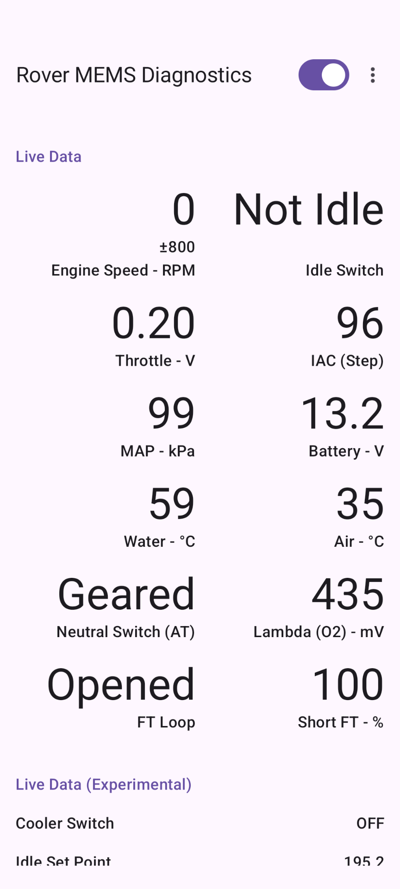
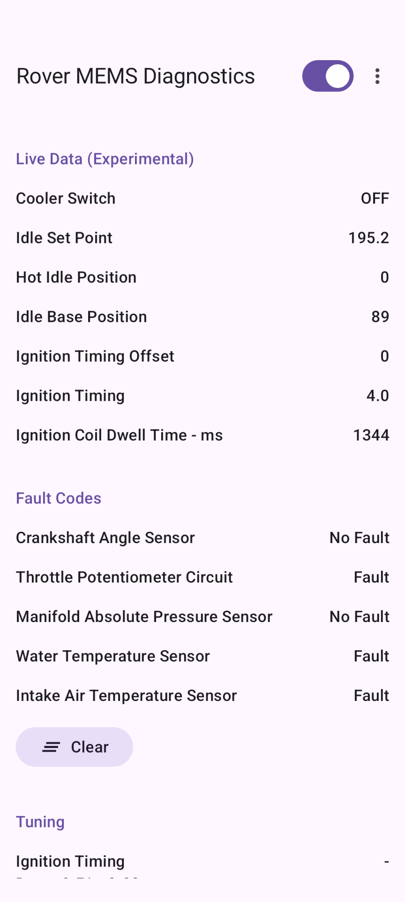
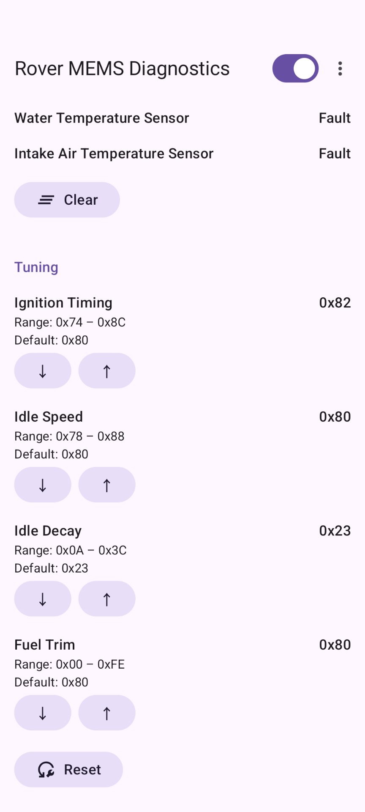

An Android application for Rover MEMS (Modular Engine Management System) diagnostics.

[🌐GitHub Pages](https://helloiamjohndoenicetomeetyou.github.io/Rover-MEMS-Diagnostics/)

[🖥️GitHub Repository](https://github.com/helloiamjohndoenicetomeetyou/Rover-MEMS-Diagnostics)

## Screenshots

## Download
Version 2026.04.18.16.48

[📦️Download APK](https://github.com/helloiamjohndoenicetomeetyou/Rover-MEMS-Diagnostics/releases/download/2026.04.18.16.48/2026.04.18.16.48.apk)

## System Requirements
* Android Version: Android 8.0 (Oreo) or Later (API Level 26 or Higher)
* Connectivity: USB OTG Support

## Supported ECU Version
* MEMS 1.6 (Commonly found in Classic Mini SPI)

## Features
* Live Data
* Fault Codes
* Tuning

## Donations
If you find this application useful, donations via PayPal are greatly appreciated to support
further development.

[🍵PayPal Me](https://paypal.me/helloiamjohndoe)

## Privacy Policy
### Collection and Use of Personal Information

This application does not collect, store, or transmit any personally identifiable information
(such as name, address, email address, phone number, or location data).

### Advertising

This application does not display any advertisements and does not collect any identifiers for the
purpose of advertising.

### Disclosure to Third Parties

This application utilizes USB host functionality to access or interact with connected USB devices.
Any data accessed through this permission is processed exclusively on the local device for the
application's internal functions and is never transmitted to external servers or shared with third
parties.

### Application Permissions

While the application may request certain permissions (such as USB) required for its functionality,
any data accessed through these permissions is processed only on the device and is never transmitted
externally.

### Disclaimer

The developers shall not be held responsible for any actions taken by the user through the use of
this application.
The developers are not liable for any damages or losses (including vehicle damage) arising from the
use of the application.

### Contact Information

If you have any questions or feedback regarding this policy or the application,
please contact us at:

[📥️Google Forms](https://forms.gle/paUb2w6nW7kRLMjv7)

## License

Copyright (C) 2025 helloiamjohndoenicetomeetyou

This application is licensed under the GNU GENERAL PUBLIC LICENSE -- see the [LICENSE](../LICENSE) file
for details.
